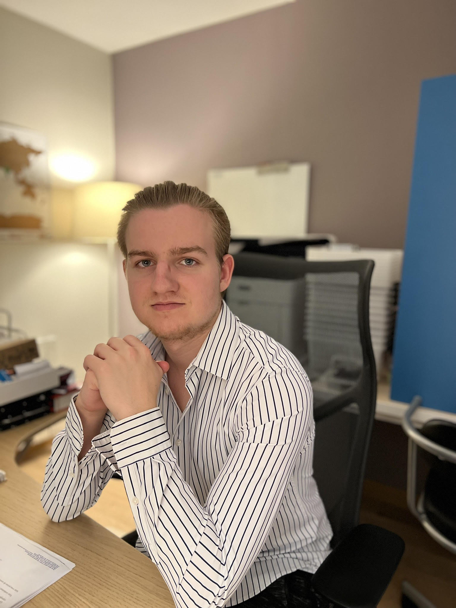

### 👀 À propos de moi

💻 Je suis passionné d'**informatique** depuis plusieurs années   
🕹 J'ai travaillé sur un petit projet de construction d'une **borne d'arcade** sur mon temps libre  
🏋️‍♀️ Aime faire du sport  
👨‍💻 Participant de plusieurs Devoxx4Kids étant plus jeunes, avec mon frêre  

### ✅ Mes compétences
* **Débutant** en HTML, CSS, Java, JavaFX, Python, Django, Angular
* Appris **Python** au lycée avec la spécialité **NSI**

### 📚 Mes Études
* Lycée Polyvalent Jules Verne de Cergy-Le-Haut 2019-2022
* BTS SIO SLAM à l'ESIEE-IT 2022-2024
* Baccalauréat Général avec mention
